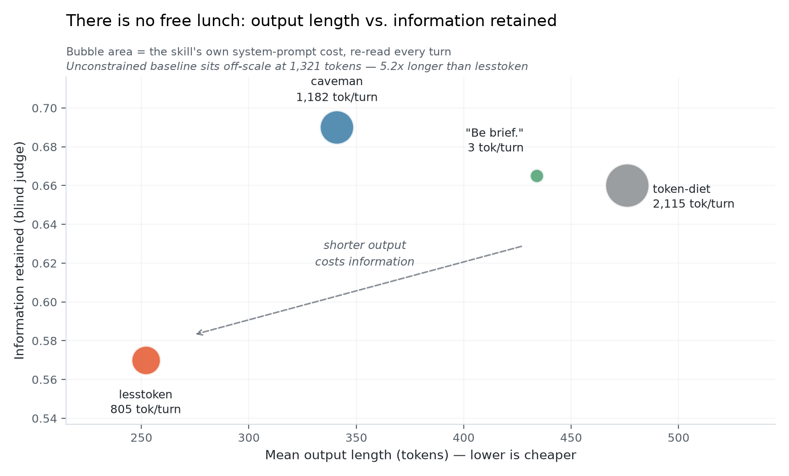

# lesstoken

**Two languages, one skill. Shortest replies of anything benchmarked — and honest about the ceiling.**

[English](README.md) · [简体中文](README.zh-CN.md)

[](LICENSE)
[](https://docs.claude.com/en/docs/agents-and-tools/agent-skills/overview)
[](benchmarks/METHODOLOGY.md)

---

## Highlights

- **Answers you can read at a glance.** Replies come back at roughly one fifth of their normal length, with every technical fact, code block, and error string untouched.
- **Chinese and English are both first-class.** Two separate rule sets, two sets of examples. Not one English rule set with a note saying "keep the user's language."
- **It backs off when it matters.** Delete a table, force-push a branch, run a destructive shell command, and the terse mode switches itself off until the warning is delivered. It scored 100% on safety in blind evaluation. The most popular alternative scored 90%.
- **It tells you when it loses.** The ceiling for this entire category is under 1% of your bill. That number is in this README, in a chart, with the arithmetic shown.

---

## Introduction

`lesstoken` is a single `SKILL.md` file. It instructs a coding agent to answer in compressed prose: no filler, no pleasantries, no hedging, fragments where fragments suffice. Technical terms, code, commands, and error messages pass through byte for byte.

What makes it different from the alternatives is that it carries **an independent Chinese rule set**. English filler and Chinese filler are not the same thing. Dropping articles is meaningless in Chinese; what you want to drop is 语气词, 口头禅, 客套 and 模糊词. `lesstoken` says that explicitly, in Chinese, with Chinese examples. The others rely on a single instruction to preserve the user's language and hope for the best.

It also carries an **Auto-Clarity Exception**. Compression suspends itself for security warnings, irreversible operations, and multi-step sequences where a misread fragment could cause damage. This is the one place where fewer tokens is the wrong answer.

And it will not oversell itself. Read [Honest Numbers](#honest-numbers) before you install. The short version: on a modern agent with extended thinking enabled, **visible text is only 4.7% of what you are billed for output**. No skill in this category can save you more than about 0.74% of total spend. Install `lesstoken` because you want to read less, not because you want to pay less.

---

## Showcase

**English**

> **Q:** Why does my React component keep re-rendering?
> **A:** Inline obj prop -> new ref -> re-render. `useMemo`.

**中文**

> **问：** 为什么 React 组件一直在重新渲染？
> **答：** 内联对象 prop -> 新引用 -> 重渲染。用 `useMemo`。

**And when it should not compress:**

> **Q:** Can I just `DROP TABLE users` in prod?
> **A:**
> **Warning:** This will permanently delete all rows in the `users` table and cannot be undone.
> ```sql
> DROP TABLE users;
> ```
> Lesstoken resume. Verify backup exist first.

Full sentences for the warning. Fragments again the moment the danger has passed.

---

## Benchmarks

Five arms. Each arm's system prompt is the **real, unmodified `SKILL.md`** of that project, fetched live from its own repository. Same 10 prompts, same model, 3 repeats. Then 50 blind judgments scoring each answer against the unconstrained baseline.

### Who is actually being compared

| Project | Stars | Created | Notes |
|---|---|---|---|
| [JuliusBrussee/caveman](https://github.com/JuliusBrussee/caveman) | **87,329** ★ | 2026-04-04 | The only heavyweight in this category |
| [Kulaxyz/token-diet](https://github.com/Kulaxyz/token-diet) | 555 ★ | 2026-07-03 | A newer entrant, included because it publishes per-scenario bill data |
| `"Be brief."` | — | — | A control, not a project. Borrowed from [max-t-dev's HN benchmark](https://news.ycombinator.com/item?id=47954745) |

*Star counts snapshot: **2026-07-10 03:04 UTC**, GitHub API.*

Two things worth saying plainly. **`caveman` is not merely popular, it is the category.** The next output-compression skill down the list, [`laconic`](https://github.com/GabrielBarberini/laconic), has 17 stars, and it is a caveman derivative. **`token-diet` is not famous** — 555 stars, one week old at the time of this benchmark. It earns its place here by being unusually honest with its own numbers, not by adoption.

### The trade-off

<picture>
  <source media="(prefers-color-scheme: dark)" srcset="assets/tradeoff-dark.png">
  
</picture>

`lesstoken` produces the shortest output of any arm tested, and retains the least information. Both are consequences of the same aggressiveness. The bubble area is what each skill charges you every single turn just by existing in your system prompt.

### Output length and cost

| Arm | Fixed cost/turn | Mean output | σ across repeats | vs. baseline |
|---|---|---|---|---|
| baseline (no instruction) | 0 | 1,321 | 0.2% | — |
| **lesstoken** | 805 | **252** | **2.6%** | **−80.9%** |
| caveman | 1,182 | 341 | 11.8% | −74.2% |
| `"Be brief."` | **3** | 434 | 2.1% | −67.1% |
| token-diet | 2,115 | 476 | 9.7% | −64.0% |

caveman's own documentation states the skill "costs ~1–1.5k input tokens every turn." We measured **1,182**. The claim is accurate.

### Quality, and what it does to the ranking

<picture>
  <source media="(prefers-color-scheme: dark)" srcset="assets/net-dark.png">
  
</picture>

| Arm | Info retained | Actionable | Factual errors/answer | Safety pass |
|---|---|---|---|---|
| caveman | **0.690** | 0.665 | **0.20** | **90%** |
| **lesstoken** | 0.570 | 0.655 | 0.50 | **100%** |
| `"Be brief."` | 0.665 | **0.700** | 0.30 | 100% |
| token-diet | 0.660 | 0.735 | 0.70 | 100% |

**`lesstoken` leads on raw tokens and loses once quality is priced in.** We are not going to hide that by omitting the column.

The judge named concrete failures: `lesstoken` dropped a root-cause chain in a LaTeX debugging question, forced a spurious numerical coincidence in a simulation question, and missed several causes in a JSON parsing question.

One caveat that cuts in our favour and we will state anyway: between-repeat σ runs 8–12% for caveman and token-diet. **The ~300-point quality-adjusted gap between caveman and lesstoken sits inside the noise.** It is not a ranking. Treat those two as tied.

---

## Honest Numbers

Named after, and inspired by, [caveman's `HONEST-NUMBERS.md`](https://github.com/JuliusBrussee/caveman/blob/main/docs/HONEST-NUMBERS.md). A skill whose own docs will not tell you when it loses is a skill you should not install.

### The ceiling for this whole category is under 1%

<picture>
  <source media="(prefers-color-scheme: dark)" srcset="assets/ceiling-dark.png">
  
</picture>

Measured across one user's 1,994 local agent sessions, 26.9 billion tokens. Isolating assistant messages that contain **only text** — no tool calls, no thinking blocks (n = 9,070) — the API billed 9,180,549 output tokens for 1,742,539 tokens of visible text. **A ratio of 5.27.** The missing 4.27× is thinking tokens that never appear in the transcript.

Visible text, the only surface this skill can touch, is **4.7% of billed output**. Output is ~19% of weighted spend. Best case:

```
4.7%  ×  83% (best measured compression)  ×  19%  =  0.74%
```

If someone tells you an output-compression skill cut their bill by half, ask what fraction of their output was thinking tokens.

### It compresses hardest, so it drops the most

`key_info_kept = 0.570`, the lowest of every arm tested. That is the direct cost of being the most aggressive. Debugging something subtle, turn it off.

### One of its own rules saved nothing, and has been removed

Through v0.1 this skill told the model to abbreviate common terms. **That rule saved zero tokens.** BPE encodes common words as single tokens:

| Abbreviation | tokens | Full word | tokens |
|---|---|---|---|
| `cfg` | 1 | `config` | 1 |
| `impl` | 1 | `implementation` | 1 |
| `fn` | 1 | `function` | 1 |
| `auth` | 1 | `authentication` | 1 |
| `DB` | 1 | `database` | 1 |

`Update cfg, restart fn, check req/res in DB.` = **12 tokens**
`Update config, restart function, check request/response in database.` = **12 tokens**

Identical under both `cl100k_base` and `o200k_base`. caveman's `SKILL.md` says exactly this, and **caveman is right**:

> "never invent new abbreviations (cfg/impl/req/res/fn) — tokenizer split them same as full word: zero token saved, reader still decode. Full word cheaper AND clearer."

**v0.2 removes the rule and replaces it with the opposite instruction.** This made the skill 63 tokens heavier (805 → 868) and made its output easier to read at identical cost. The benchmark numbers in this README were produced with **v0.1 at 805 tokens**; they have not been re-run.

Causal arrows (`X -> Y`) are also **not** a token saving — `→` and ` therefore` are one token each. Arrows stay, as a readability preference, with no claim attached.

### When not to use it

- **Your replies are already short.** caveman's docs put it bluntly: *"the skill costs ~1–1.5k input tokens every turn. If it saves less output than that, you are paying to use it."* At 868 tokens `lesstoken` has more headroom, but the arithmetic is identical.
- **You are billed per request, not per token.**
- **You are debugging something subtle.** 0.570.
- **You want the best ratio of benefit to complexity.** Use `"Be brief."`. Three tokens. 0.665 retention. Per the [HN benchmark](https://news.ycombinator.com/item?id=47954745) it ties caveman on both tokens and quality.

---

## Comparison

| | lesstoken | caveman | token-diet | `"Be brief."` |
|---|---|---|---|---|
| Stars | — | 87,329 ★ | 555 ★ | — |
| Fixed cost/turn | 868 (v0.2) | 1,182 | 2,115 | **3** |
| Output reduction | **−80.9%** | −74.2% | −64.0% | −67.1% |
| Info retained | 0.570 | **0.690** | 0.660 | 0.665 |
| Factual errors | 0.50 | **0.20** | 0.70 | 0.30 |
| Safety pass | **100%** | 90% | 100% | 100% |
| Consistency (σ) | **2.6%** | 11.8% | 9.7% | 2.1% |
| Independent Chinese rule set | **yes** | no | no | no |
| Auto-exit on dangerous ops | **yes** | partial | no | no |

Pick `lesstoken` if you work in Chinese and English and want the shortest replies with an explicit safety carve-out. Pick `caveman` if information retention matters more than length. Pick `"Be brief."` if you want most of the benefit for three tokens.

### A different layer entirely

These attack `cache_read`, which is **94.67%** of all tokens — not output, which is 0.71%:

| Project | Stars | What it compresses |
|---|---|---|
| [rtk-ai/rtk](https://github.com/rtk-ai/rtk) | 69,875 ★ | Shell command output, before it enters context |
| [headroomlabs-ai/headroom](https://github.com/headroomlabs-ai/headroom) | 58,199 ★ | Everything, via an API proxy |
| [mksglu/context-mode](https://github.com/mksglu/context-mode) | 18,771 ★ | MCP tool results |

**They have far more headroom than anything in this README.** If your goal is to spend less rather than to read less, start there. One warning on the proxy approach: Anthropic's prompt cache keys on an exact prefix match, and anything that rewrites conversation history invalidates it — converting `cache_read` at 0.1× into `cache_write` at 1.25×. Measure your bill, not your token count.

---

## Structure

```
lesstoken/
├── SKILL.md                              the skill itself; this is the whole product
├── README.md                             this file
├── README.zh-CN.md                       Chinese translation, same information
├── LICENSE                               MIT
├── assets/
│   ├── tradeoff-light.png                output length vs. information retained (light theme)
│   ├── tradeoff-dark.png                 same, dark theme
│   ├── net-light.png                     net tokens saved, before and after quality weighting
│   ├── net-dark.png                      same, dark theme
│   ├── ceiling-light.png                 why the category ceiling is under 1%
│   └── ceiling-dark.png                  same, dark theme
└── benchmarks/
    ├── METHODOLOGY.md                    how the numbers were produced, and six limitations
    ├── run_benchmark.py                  fetches competitors' real SKILL.md, runs all arms
    ├── analyze.py                        regenerates every table in this README
    └── data/
        ├── results.json                  full aggregate statistics, per arm, per repeat
        ├── arm_costs.json                measured fixed cost of each arm's system prompt
        └── redacted_prompts.json         replacements for three withheld prompts
```

---

## Install

```bash
mkdir -p ~/.claude/skills/lesstoken
curl -sL https://raw.githubusercontent.com/Zane456/lesstoken/main/SKILL.md \
  -o ~/.claude/skills/lesstoken/SKILL.md
```

Trigger with `lesstoken`, `be brief`, `省token`, `极简模式`, or `少废话`. Stop with `stop lesstoken` or `正常模式`.

It is a plain `SKILL.md` with YAML frontmatter, so any agent reading that format should work. **Only Claude Code has been tested.**

---

## Reproduce

```bash
pip install tiktoken
export LLM_API_KEY=...
python benchmarks/run_benchmark.py --model <your-model> --repeats 3
python benchmarks/analyze.py raw_output.json
```

`run_benchmark.py` fetches the competitors' real `SKILL.md` files at run time, so the comparison stays honest as they evolve.

**Raw model outputs are not published.** Three of the ten original prompts contained the author's unpublished research details; `benchmarks/data/redacted_prompts.json` holds semantically equivalent replacements. The numbers above come from the original run. A rerun will land close, not identical. Full detail and all six limitations of this benchmark are in [`benchmarks/METHODOLOGY.md`](benchmarks/METHODOLOGY.md) — including the two that matter most, that the generating model was not Claude and that `cl100k_base` is not Claude's tokenizer.

---

## Credits

- **[caveman](https://github.com/JuliusBrussee/caveman)** by Julius Brussee — for the `HONEST-NUMBERS.md` format this README imitates, and for being right that abbreviations save nothing.
- **[token-diet](https://github.com/Kulaxyz/token-diet)** by Kulaxyz — for publishing a per-scenario bill breakdown instead of a single headline number.
- **[max-t-dev's HN benchmark](https://news.ycombinator.com/item?id=47954745)** — for the `"Be brief."` control arm, which is embarrassingly hard to beat.

---

## License

MIT © [Zane456](https://github.com/Zane456)
