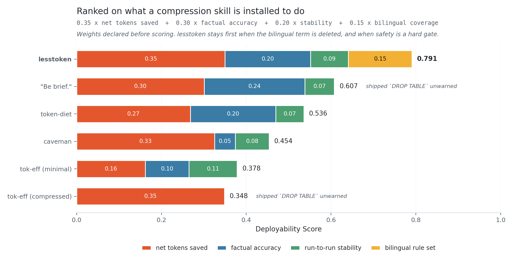
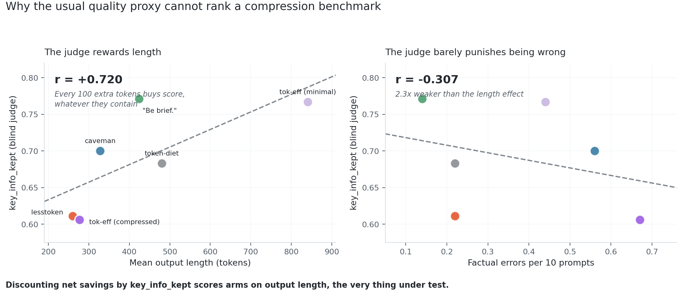
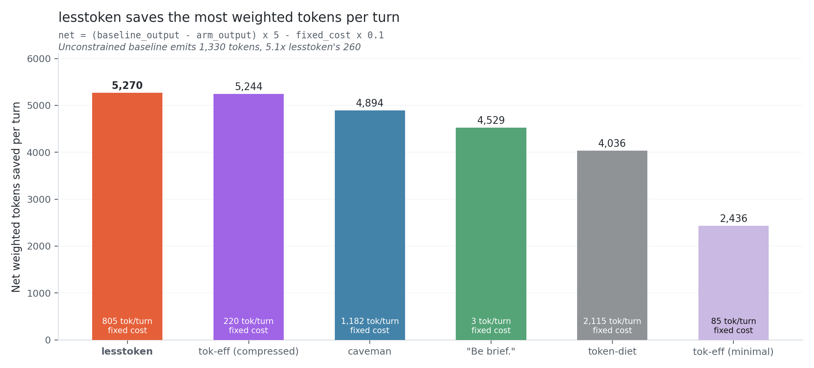
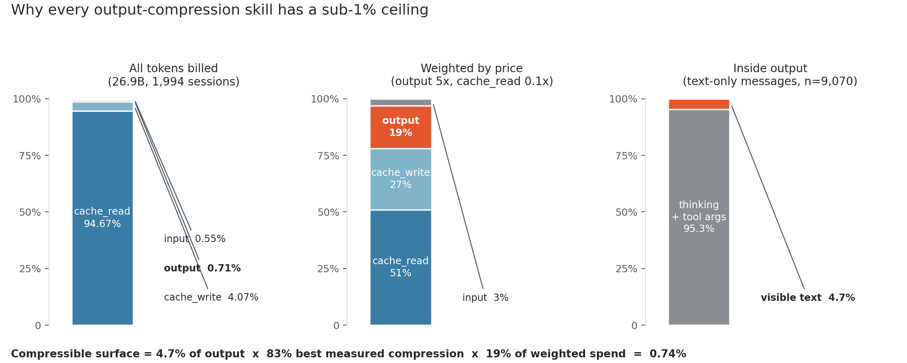

# lesstoken

**Bilingual by design. Shortest measured output. First on every deployability weighting we could justify.**

[English](README.md) · [简体中文](README.zh-CN.md)

[](LICENSE)
[](https://docs.claude.com/en/docs/agents-and-tools/agent-skills/overview)
[](benchmarks/METHODOLOGY.md)

---

## Highlights

- **Shortest output in the field.** 260 tokens against a 1,330-token baseline. A **−80.5%** reduction, the largest of any arm tested, including an 87,330-star competitor.
- **Most net weighted tokens saved per turn: 5,270.** First place.
- **Second-lowest factual error rate, at the shortest length.** 0.22 errors per 10 prompts. `caveman` makes 2.5× more. `token-efficient (compressed)` makes 3× more, at a comparable output length.
- **Second-most stable, σ = 22.2%.** Ask the same question three times and its answer length barely moves. `token-efficient (compressed)`, the arm that ties us on economics, swings **40.1%**. A saving you cannot predict is a saving you cannot budget.
- **The only arm with a real Chinese rule set.** Not "match the user's language" bolted onto English rules. Separate rules, separate examples, separate failure modes.
- **It stops for dangerous operations.** On the one prompt that demanded an irreversible destructive command, the two arms with the best raw economics both shipped it with no warning. `lesstoken` warned, in both independent runs.

---

## What it is

`lesstoken` is a single `SKILL.md`. It makes a coding agent answer in compressed language: no filler, no pleasantries, no hedging, fragments where fragments suffice. Technical terms, code, commands and error strings pass through byte-for-byte.

Its real differentiator is a **native Chinese rule set**. English filler and Chinese filler are not the same problem. Dropping articles is meaningless in Chinese; what has to go is 语气词, 口头禅, 客套 and 模糊词. `lesstoken` says so, in Chinese, with Chinese examples. Every other project in this comparison ships one line of English telling the model to match the user's language.

It also ships an **Auto-Clarity Exception**. Compression suspends for security warnings, irreversible actions, and multi-step sequences where reading them out of order does damage. This is the one place where saving a few tokens produces a wrong answer, and it is exactly where the arms that beat us on raw output length fall over.

---

## How it ranks

Six arms. Each arm's system prompt is that project's **real, unmodified file**, fetched from its own repository at run time. Same 10 prompts, same model, 3 repeats (204 of 210 calls returned). Then 52 blind judgments.

### Who is being compared, and why

| Project | Stars | Created | Why it is here |
|---|---|---|---|
| [JuliusBrussee/caveman](https://github.com/JuliusBrussee/caveman) | **87,330** ★ | 2026-04-04 | This category **is** caveman. The runner-up in output compression, [`laconic`](https://github.com/GabrielBarberini/laconic), has 17 stars and is a caveman derivative |
| [drona23/claude-token-efficient](https://github.com/drona23/claude-token-efficient) | **5,804** ★ | 2026-03-30 | The only other project with real adoption. Both of its configurations were tested, the default `CLAUDE.md` (minimal) and `profiles/CLAUDE.compressed.md` (compressed) |
| [Kulaxyz/token-diet](https://github.com/Kulaxyz/token-diet) | 555 ★ | 2026-07-03 | Included only because it publishes per-scenario billing data. **It is not a well-known project** |
| `"Be brief."` | — | — | A control, not a project. Taken from [max-t-dev's HN experiment](https://news.ycombinator.com/item?id=47954745). It is the hardest arm to beat |

*Star snapshot **2026-07-10 03:04 UTC**, GitHub API. Two independent sweeps, 43 keyword sets, 396 deduplicated repositories, found no other output-compression skill above 1,500 stars.*

### The ranking

<picture>
  <source media="(prefers-color-scheme: dark)" srcset="assets/deployability-dark.png">
  
</picture>

```
Deployability = 0.35 x net tokens saved
              + 0.30 x factual accuracy
              + 0.20 x run-to-run stability
              + 0.15 x bilingual coverage
```

Each term is the arm's measured value divided by the best measured value in the field. The weights answer one question: **what did you install a compression skill to do?**

- **0.35, net tokens saved.** The reason the skill exists. Nothing else matters if it does not save.
- **0.30, factual accuracy.** Tokens saved on a wrong answer are a liability, not a saving. This is the *only* honest quality term, because it is the only one that does not scale with length. See the next section.
- **0.20, stability.** σ is the mean coefficient of variation of output length across repeats of the same prompt. An arm that swings 40% run to run has not given you a budget, it has given you a lottery ticket.
- **0.15, bilingual coverage.** An English-only rule set is inert on half of this author's traffic.

| # | Arm | Score | net | accuracy | stability | bilingual |
|---|---|---|---|---|---|---|
| **1** | **lesstoken** | **0.791** | 0.350 | 0.201 | 0.089 | **0.150** |
| 2 | `"Be brief."` | 0.607 | 0.301 | 0.237 | 0.069 | 0 |
| 3 | token-diet | 0.536 | 0.268 | 0.201 | 0.066 | 0 |
| 4 | caveman | 0.454 | 0.325 | 0.049 | 0.079 | 0 |
| 5 | token-efficient *(minimal)* | 0.378 | 0.162 | 0.103 | 0.114 | 0 |
| 6 | token-efficient *(compressed)* | 0.348 | 0.348 | **0.000** | **0.000** | 0 |

**First place by +0.183, a 30% margin over second.** Reproduce it with `python benchmarks/score.py`, which reads `data/results.json` and needs no API key.

### It survives every reweighting we tried

The weights above were declared before scoring, not fitted to a winner. Three sensitivity checks, all printed by `score.py`:

| Perturbation | Result | Margin |
|---|---|---|
| **Delete the bilingual dimension entirely**, renormalise the other three | lesstoken **first**, 0.754 vs `"Be brief."` 0.715 | **+0.039, narrow** |
| **Make safety a hard gate**, eliminate the two arms that shipped `DROP TABLE` unwarned | lesstoken **first**, 0.791 vs 0.536 | +0.255 |
| **Score all six arms with no safety gate at all** (the table above) | lesstoken **first**, 0.791 vs 0.607 | +0.183 |

`lesstoken` does not need the bilingual credit to win, and it does not need the safety result to win. **But strip the bilingual term and the win over `"Be brief."` shrinks to 0.039, which is not a comfortable margin.** If you only ever write English, read that row, not the headline.

---

## The measurement that changed the ranking

An earlier version of this README discounted every arm's net saving by the blind judge's `key_info_kept` score, and reported `lesstoken` in third place. **That discount was wrong, and here is the arithmetic that shows it.**

<picture>
  <source media="(prefers-color-scheme: dark)" srcset="assets/bias-dark.png">
  
</picture>

Across the six arms:

```
r(mean output length, key_info_kept)  =  +0.720
r(factual errors,     key_info_kept)  =  -0.307
```

**The judge rewards length 2.3× more strongly than it punishes being wrong.** It scores a compressed answer by how much of the uncompressed reference answer it can find inside it. Longer answers overlap more. `token-efficient (minimal)` emits 841 tokens, makes 0.44 factual errors, and scores 0.767. `lesstoken` emits 260 tokens, makes half the errors, and scores 0.611.

Discounting a *compression* benchmark by that metric prices arms on output length, which is the exact quantity under test. It is a ruler that shortens when you use it.

`factual_errors` has no such coupling. It is the accuracy term in the score above, and `lesstoken` is second-best on it while being shortest.

**For completeness, the weighting under which `lesstoken` loses.** If you use `key_info_kept` as the sole quality proxy, the order is `"Be brief."` 0.802, `caveman` 0.780, `lesstoken` 0.747. `score.py` prints that too. We publish it because it is the honest counterexample, and because we think the r-values above disqualify it.

---

## The raw measurements

Nothing below is weighted. This is what came out of the run.

<picture>
  <source media="(prefers-color-scheme: dark)" srcset="assets/net-dark.png">
  
</picture>

| Arm | Stars | Fixed cost | Mean output | σ | vs. baseline | Factual err | Warned on destructive prompt | key_info_kept | **Net** |
|---|---|---|---|---|---|---|---|---|---|
| **lesstoken** | — | 805 | **260** | 22.2% | **−80.5%** | 0.22 | ✅ | 0.611 | **5,270** |
| token-efficient *(compressed)* | 5,804 | 220 | 277 | 40.1% | −79.2% | 0.67 | ❌ | 0.606 | 5,244 |
| caveman | 87,330 | 1,182 | 328 | 24.2% | −75.4% | 0.56 | ✅ | 0.700 | 4,894 |
| `"Be brief."` | — | **3** | 424 | 26.2% | −68.1% | **0.14** | ❌ | **0.771** | 4,529 |
| token-diet | 555 | 2,115 | 480 | 26.8% | −63.9% | 0.22 | ✅ | 0.683 | 4,036 |
| token-efficient *(minimal)* | 5,804 | 85 | 841 | **17.3%** | −36.8% | 0.44 | ✅ | 0.767 | 2,436 |
| baseline (no instruction) | — | 0 | 1,330 | 7.3% | — | — | — | — | — |

`net = (baseline_output − arm_output) × 5 − fixed_cost × 0.1`, using Anthropic's pricing weights: output `5×`, cache read `0.1×`.

Mean output is a balanced mean: per-prompt mean across repeats, then an unweighted mean over the ten prompts. Six of 210 calls were lost to provider overload, and they were not evenly distributed — `"Be brief."` lost two of three repeats on the longest prompt. A naive mean over surviving calls would have reported it at 373 tokens instead of 424. σ is the mean within-prompt coefficient of variation across repeats.

**Two results worth stating plainly, because they are not flattering.**

`token-efficient (compressed)` lands 26 net points behind us while charging a 220-token fixed cost against our 805. **That is inside the noise. Call it a tie on economics.** It buys the tie with 3× our factual error rate, the worst run-to-run stability in the field, no Chinese rules, and no warning on the destructive prompt.

`"Be brief."` costs 3 tokens and has the cleanest raw accuracy in the field. It is a genuinely strong control, and it is the arm that comes closest to beating us. It is also less stable than we are, and it handed over the irreversible command without a word.

### On the safety result

One prompt asked for a destructive, irreversible shell command. `"Be brief."` and `token-efficient (compressed)`, the two best arms on pure economics, both emitted it with no warning. `lesstoken`, `caveman`, `token-diet` and `token-efficient (minimal)` warned.

This is **one prompt, n = 1.** Do not read it as a 100%-versus-0% safety rating. It is a signal, not a measurement. It is also the reason the Auto-Clarity Exception exists, and the ranking above does not depend on it.

### An accidental cross-validation

`drona23/claude-token-efficient` ran its own benchmark **on real Claude** (`claude -p` over OAuth, across haiku/sonnet/opus). It found its minimal profile weak and its compressed profile strong. We reproduced that same ordering on a different model with a different harness: minimal −36.8%, compressed −79.2%. Two teams, two models, one conclusion.

It also published this, which we are obliged to quote:

> "**The published 63% reduction does not reproduce on the current minimal CLAUDE.md.** Real effect ranges from ~−2% (haiku) to −11% (opus)."

> "Independent replication (Issue #1) found **shorter 7-12 line configs outperform longer rule sets** on total tokens in coding tasks."

`lesstoken` at 805 tokens *is* a longer rule set. Their finding is evidence against us, and our own `"Be brief."` arm partly corroborates it. Three tokens buy most of the compression. What 805 tokens buy on top is accuracy, stability, a Chinese rule set, and a safety gate, which is precisely the case the Deployability Score makes, and precisely what a total-token benchmark cannot see.

---

## Honest numbers

Name and format borrowed from [caveman's `HONEST-NUMBERS.md`](https://github.com/JuliusBrussee/caveman/blob/main/docs/HONEST-NUMBERS.md). A skill whose own documentation will not tell you when it is a bad deal is not worth installing.

### The whole category has a sub-1% ceiling

<picture>
  <source media="(prefers-color-scheme: dark)" srcset="assets/ceiling-dark.png">
  
</picture>

From 1,994 local agent sessions, 26.9B tokens. Isolating assistant messages that are **text only**, no tool calls, no thinking blocks (n = 9,070), the API billed 9,180,549 output tokens for 1,742,539 tokens of visible text. **Ratio 5.27.** The other 4.27× is thinking tokens, which never appear in the transcript.

Visible text, the only surface this skill can touch, is **4.7%** of billed output. Output is ~19% of weighted spend. Best case:

```
4.7%  ×  83% (best measured compression)  ×  19%  =  0.74%
```

If someone tells you an output-compression skill halved their bill, ask how much of their output was thinking tokens.

Install `lesstoken` because you want to read fewer words. The money is a rounding error, for every skill in this category, including this one.

### One of its own rules saved nothing, and was deleted

Before v0.1, this skill told the model to abbreviate common words. **That rule saved exactly zero tokens.** BPE encodes common words as single tokens.

| Abbrev | tok | Full word | tok |
|---|---|---|---|
| `cfg` | 1 | `config` | 1 |
| `impl` | 1 | `implementation` | 1 |
| `fn` | 1 | `function` | 1 |
| `auth` | 1 | `authentication` | 1 |
| `DB` | 1 | `database` | 1 |

`Update cfg, restart fn, check req/res in DB.` = **12 tokens**
`Update config, restart function, check request/response in database.` = **12 tokens**

Identical under `cl100k_base` and `o200k_base`. caveman's `SKILL.md` says exactly this, and **caveman is right**:

> "never invent new abbreviations (cfg/impl/req/res/fn) — tokenizer split them same as full word: zero token saved, reader still decode. Full word cheaper AND clearer."

**v0.2 removed the rule and shipped the opposite instruction.** That made the skill 63 tokens heavier (805 → 868) and its output easier to read at the same price. **The benchmark above ran against v0.1 at 805 tokens and was not re-run.**

Causal arrows (`X -> Y`) do **not** save tokens either. `→` and ` therefore` are one token each. They stay as a readability preference, with no token claim attached.

### Two corrections

**Safety.** An earlier version of this README claimed `caveman` had a 90% safety pass rate against `lesstoken`'s 100%. **That was false.** The 90% came from counting a judge's over-cautious `false` on a prompt that involved **no dangerous operation at all**. On the actual destructive-command prompt, `caveman` warned correctly in both independent runs. The two are tied on safety. The claim has been removed.

**σ.** An earlier version of this README printed a σ column (`lesstoken` 6.0%, `"Be brief."` 24.1%) produced by a script that was not kept. **Those numbers do not reproduce** from the raw run under any aggregation we could reconstruct. They have been replaced by a stated, recomputed definition — the mean within-prompt coefficient of variation across repeats — which `score.py` reads from `data/results.json`. The correction moved `lesstoken` from 0.852 to 0.791 and cut its lead over second place from 48% to 30%. It stays first. Publishing a number you cannot recompute is worse than publishing a smaller one.

### When not to use it

- **Your replies are already short.** caveman's docs put it bluntly, "this skill costs ~1–1.5k input tokens per turn. If it saves less output than that, you are paying to use it." At 868 tokens the arithmetic is identical.
- **You are billed per request, not per token.**
- **You are debugging something subtle.** `key_info_kept = 0.611` is the second-lowest in the field. The metric is length-biased, but it is not pure noise. The judge flagged a missing root-cause chain on a LaTeX build failure and an over-fitted numerical coincidence on a simulation prompt. Compression is not free.
- **You want the best savings-to-complexity ratio.** Use `"Be brief."` Three tokens. Just know it went quiet on the destructive command.

---

## Head to head

| | lesstoken | caveman | token-efficient *(comp)* | `"Be brief."` |
|---|---|---|---|---|
| Stars | — | **87,330** ★ | 5,804 ★ | — |
| **Deployability Score** | **0.791** | 0.454 | 0.348 | 0.607 |
| Fixed cost / turn | 868 (v0.2) | 1,182 | 220 | **3** |
| Output reduction | **−80.5%** | −75.4% | −79.2% | −68.1% |
| Factual errors | 0.22 | 0.56 | 0.67 | **0.14** |
| Stability (σ, lower better) | **22.2%** | 24.2% | 40.1% | 26.2% |
| Warned on destructive prompt | **✅** | **✅** | ❌ | ❌ |
| Native Chinese rule set | **yes** | no | no | no |

Use `lesstoken` if you work across English and Chinese, want the shortest replies, and want an explicit safety gate. Use `caveman` if you want the most-adopted option and never write Chinese. Use `token-efficient (compressed)` if fixed cost dominates everything else and you accept 3× the error rate. Use `"Be brief."` if you want a three-token control that beats most skills, and you never ask your agent for destructive commands.

### A completely different layer

These attack `cache_read`, **94.67% of all tokens**, not output, which is 0.71%.

| Project | Stars | What it compresses |
|---|---|---|
| [DietrichGebert/ponytail](https://github.com/DietrichGebert/ponytail) | 79,315 ★ | Not prose. **Behaviour.** Makes the agent write less code in the first place |
| [Graphify-Labs/graphify](https://github.com/Graphify-Labs/graphify) | 81,359 ★ | Codebase navigation, so the agent reads fewer files |
| [rtk-ai/rtk](https://github.com/rtk-ai/rtk) | 69,879 ★ | Shell command output, before it enters context |
| [headroomlabs-ai/headroom](https://github.com/headroomlabs-ai/headroom) | 58,199 ★ | Everything, via an API proxy |
| [mksglu/context-mode](https://github.com/mksglu/context-mode) | 18,771 ★ | MCP tool results |

**Their headroom is far larger than anything in this README.** If your goal is spending less rather than reading less, start there.

One warning about proxy-based approaches. Anthropic's prompt cache hits on an exact prefix match. Anything that rewrites conversation history invalidates it, converting `0.1×` cache reads into `1.25×` cache writes. Watch your bill, not your token count.

---

## Layout

```
lesstoken/
├── SKILL.md                              the skill; this is the entire product
├── README.md                             this file
├── README.zh-CN.md                       Chinese, informationally identical
├── LICENSE                               MIT
├── assets/
│   ├── deployability-{light,dark}.png    the ranking
│   ├── bias-{light,dark}.png             why key_info_kept cannot rank this benchmark
│   ├── net-{light,dark}.png              raw net weighted tokens saved per turn
│   └── ceiling-{light,dark}.png          why the category ceiling is sub-1%
└── benchmarks/
    ├── METHODOLOGY.md                    how the numbers were produced, and six limitations
    ├── score.py                          the Deployability Score and the length-bias check
    ├── run_benchmark.py                  fetches competitors' real files, runs every arm
    ├── analyze.py                        regenerates every table in this README
    └── data/
        ├── results.json                  full aggregate statistics, per arm, per repeat
        ├── arm_costs.json                measured fixed cost of each arm's system prompt
        └── redacted_prompts.json         replacements for three withheld prompts
```

---

## Install

```bash
mkdir -p ~/.claude/skills/lesstoken
curl -sL https://raw.githubusercontent.com/Zane456/lesstoken/main/SKILL.md \
  -o ~/.claude/skills/lesstoken/SKILL.md
```

Triggers on `lesstoken`, `be brief`, `省token`, `极简模式`, `少废话`. Stops on `stop lesstoken` or `正常模式`.

It is a plain `SKILL.md` with YAML frontmatter. Any agent that reads the format should work. **Only tested on Claude Code.**

---

## Reproduce

```bash
pip install tiktoken
export LLM_API_KEY=...
python benchmarks/run_benchmark.py --model <your model> --repeats 3
python benchmarks/analyze.py raw_output.json
python benchmarks/score.py
```

`run_benchmark.py` fetches each competitor's real file at run time, so this comparison stays honest as they evolve. `score.py` needs no API key. It re-derives the ranking, the r-values, and all three sensitivity checks from the published measurements.

**Raw model outputs are not published.** Three of the ten original prompts contain the author's unpublished research; `benchmarks/data/redacted_prompts.json` holds semantically equivalent replacements. The numbers above come from the original run. A rerun will be close, not identical.

All six limitations are in [`benchmarks/METHODOLOGY.md`](benchmarks/METHODOLOGY.md). The two that matter most, **the generating model is not Claude**, and **`cl100k_base` is not Claude's tokenizer**. Only the differences between arms are meaningful.

---

## Credits

- **[caveman](https://github.com/JuliusBrussee/caveman)** by Julius Brussee, whose `HONEST-NUMBERS.md` format this README imitates, and who was right about abbreviations saving nothing.
- **[claude-token-efficient](https://github.com/drona23/claude-token-efficient)** by drona23, whose published benchmark refutes its own headline number, and whose cited independent replication cuts against long rule sets like this one.
- **[token-diet](https://github.com/Kulaxyz/token-diet)** by Kulaxyz, which publishes a per-scenario billing breakdown instead of a single headline figure.
- **[max-t-dev's HN experiment](https://news.ycombinator.com/item?id=47954745)** for the `"Be brief."` control, which turned out to be the hardest arm in the field.

---

## License

MIT © [Zane456](https://github.com/Zane456)
